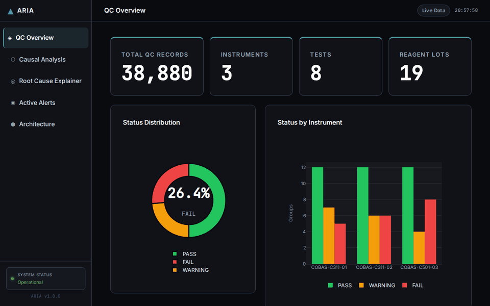

# ARIA

**Automated Root-cause Intelligence for Analytical Laboratories**

ARIA is a causal AI system that monitors laboratory QC data and identifies the root cause of failures. When a QC run fails, ARIA does not just report the failure — it uses a causal graph to tell you which variable caused it and what would have had to change for the run to pass.

---

## The Problem

Every laboratory runs daily quality control checks. When a QC run fails, the technician knows the result is wrong, but not why. Was it the reagent lot? The instrument? Temperature drift? A calibration that ran too long?

In most labs, that investigation takes hours and relies on experience. ARIA answers the question in seconds using causal inference, not correlation.

---

## Solution Overview

ARIA builds a directed acyclic graph (DAG) over the lab environment variables and uses DoWhy's backdoor estimator to compute average treatment effects on the QC z-score. It then generates a natural language explanation of each failure and lets users run counterfactual simulations: "if the temperature had been 19 degrees instead of 27, would this run have passed?"

The full analysis — from raw QC data to counterfactual answer — is accessible through a web dashboard served by the same FastAPI backend that handles the REST API.

---

## Key Features

- **Westgard multi-rule QC engine** — six rules (1-2s, 1-3s, 2-2s, R-4s, 4-1s, 10x) with tiered time windows. Identifies warning and rejection events independently.
- **Causal graph with DoWhy** — backdoor linear regression estimates how temperature, calibration age, and reagent lot each causally affect the z-score.
- **Counterfactual simulation** — adjust lab conditions on any failed run and simulate whether the outcome would change.
- **Root cause explainer** — natural language output for each failure with a ranked list of contributing factors.
- **FastAPI REST backend** — all analysis is available via HTTP. Suitable for LIMS integration.
- **HTML dashboard** — five pages rendered server-side with Jinja2, charts via Plotly.js. No JavaScript framework, no build step.
- **SQLite result history** — every QC evaluation is persisted for trend tracking.
- **MCP server** — exposes ARIA's analysis as tools for AI assistants via Anthropic's Model Context Protocol.
- **Docker deployment** — single `docker-compose up --build -d` deploys the full stack.
- **GitHub Actions CI/CD** — push to `main` automatically deploys to EC2.

---

## System Architecture

```
MIMIC-IV Demo (PhysioNet)
        |
        v
data/synthetic/generate.py   <-- calibrates value distributions
        |
        v
data/synthetic/qc_data.csv   <-- 116,640 QC records (180 days)
        |
        v
src/ingestion/loader.py      <-- CSV parsing, type coercion
        |
        +---> src/qc/rules.py        <-- Westgard engine (6 rules)
        |
        +---> src/causal/engine.py   <-- DoWhy DAG + ATE estimation
                    |
                    v
             src/explainer/explainer.py   <-- root cause + counterfactuals
                    |
                    v
             src/api/main.py              <-- FastAPI (port 8000)
             src/storage/db.py            <-- SQLite persistence
             src/mcp/server.py            <-- MCP tool server
                    |
                    v
             dashboard/templates/         <-- HTML pages (Jinja2)
             dashboard/static/            <-- CSS + Plotly.js charts
```

---

## Dashboard Pages

| Page | URL | What it shows |
|------|-----|---------------|
| QC Overview | `/` | KPI cards, status donut chart, grouped bar by instrument, searchable QC status table |
| Causal Analysis | `/causal` | ATE horizontal bar chart, 7-node causal DAG, detailed results table with impact ratings |
| Root Cause Explainer | `/explainer` | Failure slider (51 failures), z-score gauge, ranked contributing factors, counterfactual simulation |
| Active Alerts | `/alerts` | All current FAIL-status records with severity classification, Westgard rule reference cards |
| Architecture | `/architecture` | Interactive data flow diagram, tool stack chart, annotated file tree |

---

## How the Causal Analysis Works

ARIA constructs a domain-informed DAG with seven nodes:

```
lab_temp_c -----> z_score
hours_since_cal -> z_score
reagent_lot -----> z_score
lab_temp_c -----> hours_since_cal
```

Using DoWhy's backdoor criterion, it estimates the average treatment effect of each upstream variable on the z-score. These ATEs are the numerical backbone of every explanation and simulation in the system.

A 1-unit increase in `lab_temp_c` (1 degree above 22C) adds approximately +0.35 to the z-score deviation. A `hours_since_cal` increase of 10 hours contributes negative drift. Reagent lots are encoded as numerical bias offsets.

Counterfactuals are computed analytically: the new z-score is the original adjusted by `(new_value - original_value) * ATE` for each changed variable.

---

## QC Engine

Six Westgard rules are evaluated per instrument-test-level combination with tiered time windows:

| Rule | Type | Trigger |
|------|------|---------|
| 1-2s | Warning | \|z\| > 2.0 (most recent value) |
| 1-3s | Rejection | \|z\| > 3.0 (most recent value) |
| 2-2s | Rejection | Two consecutive values > 2.0 SD in same direction |
| R-4s | Rejection | Range between consecutive values > 4 SD |
| 4-1s | Rejection | Four consecutive values all > 1.0 SD in same direction |
| 10x | Rejection | Ten consecutive values on the same side of the mean |

---

## Data Sources

The QC time-series data is synthetic by design. Real Westgard calibration logs are confidential in clinical settings. The synthetic generator is calibrated against real **MIMIC-IV Demo** lab distributions (PhysioNet, 2023) so that value ranges, units, and instrument variation are physiologically realistic.

- 180 days of QC data
- 3 instruments (INST-A, INST-B, INST-C)
- 8 tests: Glucose, Creatinine, Sodium, Potassium, ALT, Hemoglobin, Calcium, Bilirubin
- 3 QC levels per test
- 19 reagent lots
- 116,640 total records

---

## Technology Stack

| Tool | Version | Role |
|------|---------|------|
| Python | 3.11 | All backend logic |
| FastAPI | 0.116 | REST API + HTML page serving |
| Uvicorn | 0.30 | ASGI server |
| Jinja2 | 3.1 | HTML template engine |
| Plotly.js | 2.32 | All interactive charts |
| DoWhy | 0.11 | Causal model + ATE estimation |
| pgmpy | 0.1.25 | DAG backend for DoWhy |
| scikit-learn | 1.5 | Linear regression estimator |
| pandas | 2.2 | Data loading and transformation |
| numpy | 1.26 | Z-score computation |
| SQLite | stdlib | QC result history |
| MCP | 1.0 | AI assistant integration |
| Docker | — | Container packaging |
| GitHub Actions | — | CI/CD pipeline |

---

## Local Setup

**Requirements:** Python 3.11+, make

```bash
git clone https://github.com/Anas9-8/ARIA-Automated-Root-cause-Intelligence-for-Analytical-Laboratories.git
cd ARIA-Automated-Root-cause-Intelligence-for-Analytical-Laboratories

make setup     # creates .venv and installs dependencies
make data      # generates synthetic QC dataset
make run       # starts FastAPI on http://localhost:8000
```

Open http://localhost:8000

---

## Docker Setup

```bash
docker-compose up --build -d
```

The container builds, generates the synthetic data inside the image, and starts the FastAPI server on port 8000. The `data/` directory is mounted as a volume so the SQLite database persists across restarts.

---

## REST API

With the app running, interactive API docs are at http://localhost:8000/docs

Key endpoints:

| Method | Endpoint | Description |
|--------|----------|-------------|
| GET | `/health` | Health check |
| GET | `/summary` | Dataset summary statistics |
| GET | `/qc/status` | QC status for all instrument-test-level combinations |
| GET | `/qc/failures` | Only FAIL-status records |
| GET | `/causal/analysis` | ATE values from the causal model |
| GET | `/causal/explain/{row_index}` | Root cause explanation for a specific failure |
| POST | `/causal/counterfactual` | Counterfactual simulation |
| GET | `/api/failures` | Paginated list of failed QC rows with original indices |
| GET | `/db/recent` | Last N results from SQLite history |

---

## MCP Server

ARIA includes an MCP server that exposes its analysis as tools for AI assistants. To start it:

```bash
make mcp
```

The server follows Anthropic's Model Context Protocol. It exposes QC status, causal analysis, and counterfactual simulation as callable tools for Claude or any MCP-compatible client.

---

## Deployment

### GitHub Actions CI/CD

Every push to `main` triggers an automatic deployment to EC2:

1. GitHub Actions connects to the EC2 instance over SSH.
2. On the server: `git pull origin main` fetches the latest code.
3. `docker-compose up --build -d --remove-orphans` rebuilds and restarts the container.
4. A health check confirms the app is responding on port 8000.

Workflow file: `.github/workflows/deploy.yml`

### Required GitHub Secrets

Add these at **Settings > Secrets and variables > Actions** in the repository:

| Secret | Value |
|--------|-------|
| `EC2_HOST` | Public IP of the EC2 instance |
| `EC2_SSH_KEY` | Contents of the private `.pem` key file |

### Manual deployment on EC2

```bash
ssh -i ~/.ssh/aria-key.pem ec2-user@<EC2_IP>
cd ~/aria
git pull origin main
docker-compose up --build -d --remove-orphans
```

---

## Running Tests

```bash
make test
```

Three test modules:

- `tests/test_qc.py` — unit tests for all six Westgard rules
- `tests/test_causal.py` — integration test for the causal engine and DAG loading
- `tests/test_api.py` — FastAPI endpoint tests using httpx TestClient

---

## Demo



The GIF shows the five main dashboard pages: QC Overview with live status charts, Causal Analysis with the ATE bar chart and DAG, Root Cause Explainer with counterfactual simulation, Active Alerts with Westgard severity classification, and the Architecture page with the data flow diagram.

To regenerate the demo after UI changes:

```bash
bash scripts/generate_demo.sh
```

---

## Project Structure

```
ARIA/
├── Makefile
├── requirements.txt
├── Dockerfile
├── docker-compose.yml
├── .env.example
├── README.md
├── README_DE.md
│
├── data/
│   ├── raw/mimic_demo/          <- MIMIC-IV hospital lab data (PhysioNet)
│   ├── processed/
│   └── synthetic/
│       ├── generate.py          <- Creates ~116,640 synthetic QC records
│       └── qc_data.csv
│
├── src/
│   ├── ingestion/loader.py      <- CSV parsing, timestamps, summary stats
│   ├── qc/rules.py              <- Westgard rules with tiered time windows
│   ├── causal/engine.py         <- DoWhy DAG + ATE estimation
│   ├── explainer/explainer.py   <- Root cause text + counterfactuals
│   ├── storage/db.py            <- SQLite: init / save / query
│   ├── api/main.py              <- FastAPI backend (port 8000)
│   └── mcp/server.py            <- MCP server for AI assistants
│
├── dashboard/
│   ├── static/
│   │   ├── style.css            <- Dark design system (CSS custom properties)
│   │   └── charts.js            <- All Plotly.js chart functions
│   └── templates/
│       ├── base.html            <- Shared sidebar + topbar layout
│       ├── overview.html        <- QC status: KPIs, charts, table
│       ├── causal.html          <- ATE chart, DAG, results table
│       ├── explainer.html       <- Failure slider, gauge, counterfactuals
│       ├── alerts.html          <- Active failures + rule reference
│       └── architecture.html   <- Data flow, tool stack, file tree
│
├── scripts/
│   ├── generate_demo.py         <- Playwright screenshot -> GIF pipeline
│   └── generate_demo.sh         <- One-command demo regeneration
│
├── tests/
│   ├── test_qc.py
│   ├── test_causal.py
│   └── test_api.py
│
└── docs/
    ├── architecture.md
    └── demo.gif
```

---

## Future Work

- User-uploadable QC datasets (CSV or HL7 FHIR)
- Per-instrument calibration scheduling recommendations based on drift trends
- Anomaly detection on reagent lot transitions using changepoint analysis
- Integration with LIMS systems over HL7 v2 or FHIR R4
- Multi-lab tenant support with per-site DAG calibration

---

## Author

Built by a Biotechnologischer Assistent (BTA) with machine learning engineering training. Domain knowledge from real laboratory QC practice combined with causal AI methods from the PyWhy ecosystem.
