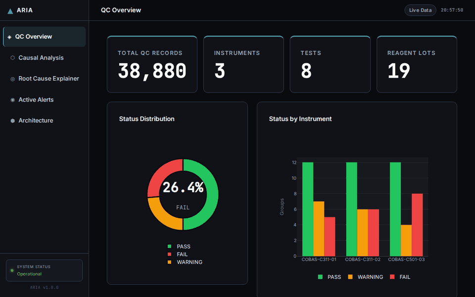

# ARIA

**Automated Root-cause Intelligence for Analytical Laboratories**

[](http://3.78.247.13:8000/causal)
[](https://github.com/Anas9-8/ARIA-Automated-Root-cause-Intelligence-for-Analytical-Laboratories/actions)
[](http://3.78.247.13:8000/health)
[](http://3.78.247.13:8000/docs)

---

## Live Deployment — No Installation Required

The application is running on AWS EC2. Open any link below in a browser right now:

| | Link |
|---|---|
| Dashboard | http://3.78.247.13:8000/causal |
| QC Overview (z-score trend with Westgard limits) | http://3.78.247.13:8000/ |
| Root Cause Explainer (counterfactual hero card) | http://3.78.247.13:8000/explainer |
| Active Alerts | http://3.78.247.13:8000/alerts |
| AI Integration (MCP) | http://3.78.247.13:8000/mcp |
| Architecture | http://3.78.247.13:8000/architecture |
| API Docs (Swagger) | http://3.78.247.13:8000/docs |
| Health Check | http://3.78.247.13:8000/health |
| CI/CD Pipeline | https://github.com/Anas9-8/ARIA-Automated-Root-cause-Intelligence-for-Analytical-Laboratories/actions |

No account, no login, no setup. The full causal AI analysis and all interactive charts are live.

---

## What's New (v1.1)

- **Counterfactual hero card** on `/explainer` — paired before/after gauges, two pre-filled sliders (lab temp, hours since calibration), and a one-click *Run Simulation* that posts to the causal engine.
- **Z-score trend chart** on `/` — 180-day time series per instrument / test / QC level, with dashed Westgard ±2σ and ±3σ control limits drawn in.
- **PNG export on every chart** (Plotly camera button) and **CSV export** per view: `qc`, `failures`, `trend`, `raw`.
- **MCP integration page** at `/mcp` — documents the exact resources and tools the MCP server exposes, with a copy-paste Claude Desktop config block.
- **Causal model on continuous z-score** — outcome is now the σ z-score (not a binary fail flag), so each ATE is "σ change in z-score per unit", and the counterfactual math is in the same units.
- **Idempotent SQLite history** — UNIQUE index on (instrument, test, level, timestamp) so polling `/qc/status` no longer duplicates rows.
- **`/api/failures` redesigned** — returns `{total, limit, shown, records}` with a per-row `severity` (`warn` for `|z|>2σ`, `fail` for `|z|>3σ`).
- **Hardened deploy** — workflow now `git fetch && git reset --hard origin/main` and `docker-compose build --no-cache`, so silent stale-cache deploys are gone.

---

## CI/CD Pipeline

Every `git push` to `main` triggers an automated deployment:

```
git push origin main
       |
       v
GitHub Actions (.github/workflows/deploy.yml)
       |
       v
SSH into AWS EC2 (appleboy/ssh-action)
       |
       +-- git pull origin main
       +-- docker-compose down --remove-orphans
       +-- docker-compose up --build -d
       +-- health check loop: polls /health every 5s (60s timeout)
       +-- verify /causal and /docs respond
       |
       v
Live at http://3.78.247.13:8000
```

The deployment is fully unattended. Secrets (EC2 host IP and private SSH key) are stored in GitHub Actions and never appear in the repository.

---

## The Problem

Every laboratory runs daily quality control checks. When a QC run fails, the technician knows the result is wrong, but not why. Was it the reagent lot? The instrument? Temperature drift? A calibration that ran too long?

In most labs, that investigation takes hours and relies on experience. ARIA answers the question in seconds using causal inference, not correlation.

---

## Solution Overview

ARIA builds a directed acyclic graph (DAG) over the lab environment variables and uses DoWhy's backdoor estimator to compute average treatment effects on the QC z-score. It then generates a natural language explanation of each failure and lets users run counterfactual simulations: "if the temperature had been 19 degrees instead of 27, would this run have passed?"

The full analysis — from raw QC data to counterfactual answer — is accessible through a web dashboard served by the same FastAPI backend that handles the REST API.

---

## Demo



The GIF shows the six dashboard pages: QC Overview with live status charts and the z-score trend, Causal Analysis with the ATE bar chart and DAG, Root Cause Explainer with the counterfactual hero card, Active Alerts with Westgard severity classification, the AI / MCP integration page, and the Architecture diagram.

To regenerate after UI changes:

```bash
bash scripts/generate_demo.sh
```

---

## Key Features

- **Westgard multi-rule QC engine** — six rules (1-2s, 1-3s, 2-2s, R-4s, 4-1s, 10x) with tiered time windows. Identifies warning and rejection events independently.
- **Causal graph with DoWhy** — backdoor linear regression estimates how temperature, calibration age, humidity, and reagent lot each causally affect the QC z-score (in σ units, per unit of treatment).
- **Counterfactual simulation hero card** — adjust lab temperature and hours-since-calibration on any out-of-control run; paired Original / Simulated z-score gauges update with a green-or-red arrow and a verdict box.
- **Z-score trend with Westgard limits** — 180-day time series chart on the Overview page with instrument / test / level filters and ±2σ / ±3σ control lines drawn in.
- **Root cause explainer** — natural language output for each failure with a ranked list of contributing factors and a reagent-lot bias hint (`-01` reference, `-02` ≈ −0.8 %, `-03` ≈ −2 %).
- **PNG / CSV export** — every chart has a built-in camera-icon PNG download; every table view (`qc` / `failures` / `trend` / `raw`) has a one-click CSV export that respects the active filters.
- **FastAPI REST backend** — all analysis is available via HTTP. Suitable for LIMS integration.
- **HTML dashboard** — six pages rendered server-side with Jinja2, charts via Plotly.js. No JavaScript framework, no build step.
- **SQLite result history (idempotent)** — every QC evaluation is persisted for trend tracking; a UNIQUE index makes repeated `/qc/status` polls a no-op instead of inserting duplicates.
- **MCP server + UI page** — exposes ARIA's analysis as tools for AI assistants via Anthropic's Model Context Protocol; a dedicated `/mcp` page documents the resources, tools, and Claude Desktop config.
- **Docker deployment** — single `docker-compose up --build -d` deploys the full stack.
- **GitHub Actions CI/CD** — push to `main` automatically deploys to EC2 with a hardened, no-cache rebuild.

---

## Technology Stack

| Tool | Version | Role |
|------|---------|------|
| Python | 3.11 | All backend logic |
| FastAPI | 0.116 | REST API + HTML page serving |
| Uvicorn | 0.30 | ASGI server |
| Jinja2 | 3.1 | HTML template engine |
| Plotly.js | 2.32 | All interactive charts |
| DoWhy | 0.11 | Causal model + ATE estimation |
| pgmpy | 0.1.25 | DAG backend for DoWhy |
| scikit-learn | 1.5 | Linear regression estimator |
| pandas | 2.2 | Data loading and transformation |
| numpy | 1.26 | Z-score computation |
| SQLite | stdlib | QC result history |
| MCP | 1.0 | AI assistant integration |
| Docker | — | Container packaging |
| GitHub Actions | — | CI/CD pipeline |
| AWS EC2 | — | Production hosting |

---

## Dashboard Pages

| Page | Live URL | What it shows |
|------|----------|---------------|
| QC Overview | [/](http://3.78.247.13:8000/) | KPI cards, **z-score trend chart with Westgard ±2σ / ±3σ limits**, status donut chart, grouped bar by instrument, searchable QC status table, CSV export per view |
| Causal Analysis | [/causal](http://3.78.247.13:8000/causal) | ATE horizontal bar chart (σ per unit of treatment), 5-node causal DAG, detailed results table with impact ratings |
| Root Cause Explainer | [/explainer](http://3.78.247.13:8000/explainer) | Failure slider over every record with `\|z\| > 2σ`, **counterfactual hero card** with Original / Simulated paired gauges, temperature + hours-since-calibration sliders, *Run Simulation* / *Reset* buttons, ranked contributing factors |
| Active Alerts | [/alerts](http://3.78.247.13:8000/alerts) | All current FAIL-status records with severity classification, Westgard rule reference cards |
| AI Integration (MCP) | [/mcp](http://3.78.247.13:8000/mcp) | Documents the 3 MCP resources and 3 tools; copy-paste Claude Desktop config; example transcript |
| Architecture | [/architecture](http://3.78.247.13:8000/architecture) | Interactive data flow diagram, tool stack chart, annotated file tree |

---

## How the Causal Analysis Works

ARIA constructs a domain-informed DAG with one outcome and four upstream causes:

```
lab_temp_c       -> z_score
humidity_pct     -> z_score
reagent_lot_id   -> z_score
hours_since_cal  -> z_score
```

The outcome is the **continuous QC z-score** (σ units), so DoWhy's backdoor linear regression returns each ATE in the same units the chart and the counterfactual use: σ-change in z-score per unit change in the treatment. These ATEs are the numerical backbone of every explanation and simulation in the system.

For example, a `lab_temp_c` ATE of `+0.012` means each °C above ambient adds ≈ 0.012 σ to the z-score on average; a 5 °C heat excursion is therefore ≈ 0.06 σ. The numbers are deliberately small per-unit because lab temperature varies by only a few degrees in normal operation.

Counterfactuals are computed analytically using the same coefficients:

```
simulated_z = original_z + Σ (new_value − original_value) * ATE_var
```

So when the simulator says *"if temp had been 22 instead of 27, z would have been X"*, both the predicted z and the chart label are in the same σ units.

---

## QC Engine

Six Westgard rules are evaluated per instrument-test-level combination with tiered time windows:

| Rule | Type | Trigger |
|------|------|---------|
| 1-2s | Warning | \|z\| > 2.0 (most recent value) |
| 1-3s | Rejection | \|z\| > 3.0 (most recent value) |
| 2-2s | Rejection | Two consecutive values > 2.0 SD in same direction |
| R-4s | Rejection | Range between consecutive values > 4 SD |
| 4-1s | Rejection | Four consecutive values all > 1.0 SD in same direction |
| 10x | Rejection | Ten consecutive values on the same side of the mean |

---

## Data Sources

The QC time-series data is synthetic by design. Real Westgard calibration logs are confidential in clinical settings. The synthetic generator is calibrated against real **MIMIC-IV Demo** lab distributions (PhysioNet, 2023) so that value ranges, units, and instrument variation are physiologically realistic.

- 180 days of QC data
- 3 instruments (`COBAS-C311-01`, `COBAS-C311-02`, `COBAS-C501-03`)
- 3 daily QC runs per instrument (07:00 / 12:00 / 18:00)
- 8 tests: Glucose, Creatinine, Sodium, Potassium, ALT, Hemoglobin, Calcium, Bilirubin
- 3 QC levels per test (L1 / L2 / L3)
- 19 reagent lots — `-01` reference, `-02` ≈ −0.8 % bias, `-03` ≈ −2 % bias
- 38,880 total records (z-scores clipped to ±4 σ — anything beyond is broken instrument, not drift)

---

## System Architecture

```
MIMIC-IV Demo (PhysioNet)
        |
        v
data/synthetic/generate.py   <-- calibrates value distributions
        |
        v
data/synthetic/qc_data.csv   <-- 38,880 QC records (180 days)
        |
        v
src/ingestion/loader.py      <-- CSV parsing, type coercion
        |
        +---> src/qc/rules.py        <-- Westgard engine (6 rules)
        |
        +---> src/causal/engine.py   <-- DoWhy DAG + ATE estimation
                    |
                    v
             src/explainer/explainer.py   <-- root cause + counterfactuals
                    |
                    v
             src/api/main.py              <-- FastAPI (port 8000)
             src/storage/db.py            <-- SQLite persistence
             src/mcp/server.py            <-- MCP tool server
                    |
                    v
             dashboard/templates/         <-- HTML pages (Jinja2)
             dashboard/static/            <-- CSS + Plotly.js charts
                    |
                    v
             AWS EC2 (docker-compose + GitHub Actions)
```

---

## REST API

Live interactive docs: http://3.78.247.13:8000/docs

| Method | Endpoint | Description |
|--------|----------|-------------|
| GET | `/health` | Health check |
| GET | `/summary` | Dataset summary statistics |
| GET | `/qc/status` | QC status for all instrument-test-level combinations (idempotent — repeated polls do not duplicate history rows) |
| GET | `/qc/failures` | Only FAIL-status records |
| GET | `/api/failures` | Out-of-control rows for the explainer; query params: `severity=warn\|fail\|all`, `limit`. Returns `{total, limit, shown, records}` with a per-row `severity` tag |
| GET | `/api/trend/options` | Available instruments / tests / QC levels (used by the trend dropdowns) |
| GET | `/api/trend` | Z-score time series with optional `instrument` / `test` / `qc_level` / `days` / `limit` filters and even-step downsampling |
| GET | `/api/export.csv` | Download a view as CSV — `view=qc\|failures\|trend\|raw`, with the same filter params as `/api/trend` |
| GET | `/causal/analysis` | ATE values from the causal model (in σ per unit of treatment) |
| GET | `/causal/explain/{row_index}` | Root cause explanation for a specific failure |
| POST | `/causal/counterfactual` | Counterfactual simulation; body validated by Pydantic (`lab_temp_c` ∈ [10, 40], `hours_since_cal` ∈ [0, 72]) |
| GET | `/causal/simulate/{row_index}` | curl-friendly counterfactual GET equivalent |
| GET | `/db/recent` | Last N results from SQLite history |

---

## MCP Server

ARIA includes an MCP server that exposes its analysis as tools for AI assistants. To start it locally:

```bash
make mcp
```

The server follows Anthropic's Model Context Protocol. The dashboard's `/mcp` page documents everything visually; programmatically the server (`src/mcp/server.py`) advertises:

**Resources** (read-only data)

| URI | Returns |
|---|---|
| `lab://qc-status` | Current Westgard status for every instrument-test-level combination |
| `lab://causal-model` | DoWhy ATE results — each upstream variable's σ-effect on the QC z-score |
| `lab://summary` | Dataset summary — record count, instruments, tests, reagent lots, date range |

**Tools** (callable actions)

| Name | Arguments | Returns |
|---|---|---|
| `get_qc_failures` | — | Active QC failures + the Westgard rule that fired |
| `get_root_cause` | — | Top causal factor and the full ATE table |
| `get_instrument_status` | `instrument_id` (e.g. `COBAS-C311-01`) | Per-instrument Westgard summary |

Wire it into Claude Desktop with this snippet in `claude_desktop_config.json`:

```json
{
  "mcpServers": {
    "aria": {
      "command": "python",
      "args": ["-m", "src.mcp.server"],
      "cwd": "/absolute/path/to/ARIA"
    }
  }
}
```

After restarting Claude Desktop you can ask things like *"Which Glucose runs on `COBAS-C311-01` are failing today?"* and Claude will call ARIA's tools.

---

## Local Development (Optional)

The app is already live on AWS. Local setup is only needed if you want to modify the code.

**Requirements:** Python 3.11+, make

```bash
git clone https://github.com/Anas9-8/ARIA-Automated-Root-cause-Intelligence-for-Analytical-Laboratories.git
cd ARIA-Automated-Root-cause-Intelligence-for-Analytical-Laboratories

make setup     # creates .venv and installs dependencies
make data      # generates synthetic QC dataset
make run       # starts FastAPI on http://localhost:8000
```

### Docker (local)

```bash
docker-compose up --build -d
```

The container builds, generates synthetic data, and starts the FastAPI server on port 8000. The `data/` directory is mounted as a volume so the SQLite database persists across restarts.

### Tests

```bash
make test
```

- `tests/test_qc.py` — unit tests for all six Westgard rules
- `tests/test_causal.py` — integration test for the causal engine and DAG loading
- `tests/test_api.py` — FastAPI endpoint tests using httpx TestClient

---

## Deployment on AWS EC2

### How it works

The deploy workflow (`.github/workflows/deploy.yml`) runs on every push to `main`:

1. GitHub Actions SSHs into the EC2 instance using a stored private key.
2. `git fetch origin main && git reset --hard origin/main` — forces EC2 to match GitHub exactly. (Earlier revisions used `git pull`, which can silently no-op if the working tree drifts; the workflow now also prints `git log --oneline -1` and `ls dashboard/templates/` so the run log proves which commit is on disk.)
3. `docker-compose down --remove-orphans` stops and removes existing containers cleanly.
4. `docker-compose build --no-cache aria` rebuilds the image from scratch — defeats Docker layer cache so template / static / Python changes always land.
5. `docker-compose up -d --force-recreate` starts a fresh container.
6. A retry loop polls `/health` every 5 seconds for up to 60 seconds.
7. Final checks confirm `/causal` and `/docs` both respond before marking the deploy successful.

### GitHub Secrets required

| Secret | Value |
|--------|-------|
| `EC2_HOST` | Public IP of the EC2 instance |
| `EC2_SSH_KEY` | Contents of the private `.pem` key file |

### Manual redeploy from EC2

```bash
ssh -i ~/.ssh/aria-key.pem ec2-user@3.78.247.13
cd ~/aria
git fetch origin main && git reset --hard origin/main
docker-compose down --remove-orphans
docker-compose build --no-cache aria
docker-compose up -d --force-recreate
```

---

## Project Structure

```
ARIA/
├── Makefile
├── requirements.txt
├── Dockerfile
├── docker-compose.yml
├── .env.example
├── README.md
├── README_DE.md
│
├── .github/
│   └── workflows/
│       └── deploy.yml           <- GitHub Actions CI/CD to AWS EC2
│
├── data/
│   ├── raw/mimic_demo/          <- MIMIC-IV hospital lab data (PhysioNet)
│   ├── processed/
│   └── synthetic/
│       ├── generate.py          <- Creates ~116,640 synthetic QC records
│       └── qc_data.csv
│
├── src/
│   ├── ingestion/loader.py      <- CSV parsing, timestamps, summary stats
│   ├── qc/rules.py              <- Westgard rules with tiered time windows
│   ├── causal/engine.py         <- DoWhy DAG + ATE estimation
│   ├── explainer/explainer.py   <- Root cause text + counterfactuals
│   ├── storage/db.py            <- SQLite: init / save / query
│   ├── api/main.py              <- FastAPI backend (port 8000)
│   └── mcp/server.py            <- MCP server for AI assistants
│
├── dashboard/
│   ├── static/
│   │   ├── style.css            <- Dark design system + new hero / mcp / toolbar styles
│   │   └── charts.js            <- All Plotly.js chart functions (incl. trend + hero gauge)
│   └── templates/
│       ├── base.html            <- Shared sidebar + topbar layout (now with /mcp link)
│       ├── overview.html        <- KPIs, z-score trend with Westgard limits, donut, bar, table, CSV
│       ├── causal.html          <- ATE chart, DAG, results table
│       ├── explainer.html       <- Failure slider + counterfactual hero card with paired gauges
│       ├── alerts.html          <- Active failures + rule reference
│       ├── mcp.html             <- AI / MCP integration page (resources, tools, Claude config)
│       └── architecture.html    <- Data flow, tool stack, file tree
│
├── scripts/
│   ├── generate_demo.py         <- Playwright screenshot -> GIF pipeline
│   └── generate_demo.sh         <- One-command demo regeneration
│
├── tests/
│   ├── test_qc.py
│   ├── test_causal.py
│   └── test_api.py
│
└── docs/
    ├── architecture.md
    └── demo.gif
```

---

## Limitations & honest notes

- **Synthetic data.** Distributions are MIMIC-IV-calibrated, but every record was produced by `data/synthetic/generate.py`. The bias coefficients in the generator (`lot_bias`, `temperature_effect`, `calibration_drift`) are deliberately small so resulting z-scores stay in the realistic `[−4, +4]` range.
- **Lot bias semantics.** `-03` lots ≈ −2 % mean bias, `-02` ≈ −0.8 %, `-01` is the reference. Explainer labels in the UI match these coefficients exactly.
- **DAG choice.** Earlier revisions had `reagent_activity` and `drift` as mediators in the DAG, but those were *constructed* deterministically from the inputs — that conflated a synthetic feature with a measured one. The current DAG models direct effects only and uses the continuous z-score as the outcome, so each ATE is a real σ-per-unit estimate.
- **Westgard "warnings" vs "failures".** `|z| > 2σ` is a Westgard *warning* (1-2s); rejection requires `|z| > 3σ` (1-3s) or a multi-point rule. The API exposes both via `/api/failures?severity=warn|fail|all` with a per-row severity tag.
- **No auth on the live demo.** The EC2 deployment is intentionally open so reviewers can click around. Don't point anything you care about at it.

---

## Future Work

- User-uploadable QC datasets (CSV or HL7 FHIR)
- Per-instrument calibration scheduling recommendations based on drift trends
- Anomaly detection on reagent lot transitions using changepoint analysis
- Integration with LIMS systems over HL7 v2 or FHIR R4
- Multi-lab tenant support with per-site DAG calibration

---

## Author

Built by a Biotechnologischer Assistent (BTA) with machine learning engineering training. Domain knowledge from real laboratory QC practice combined with causal AI methods from the PyWhy ecosystem.
